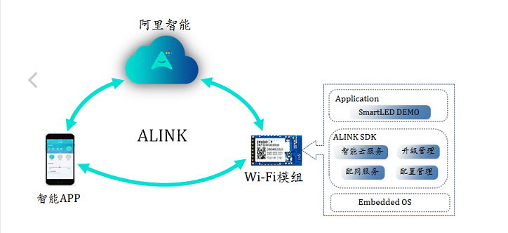
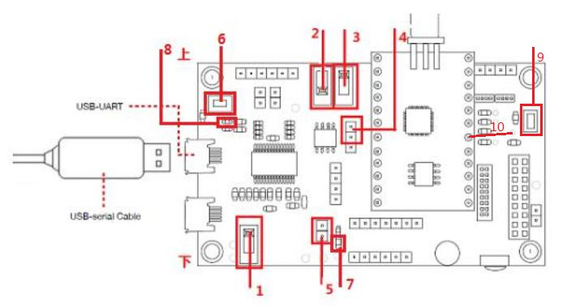
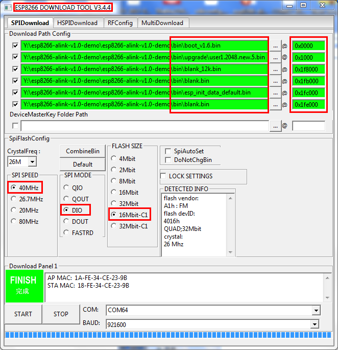
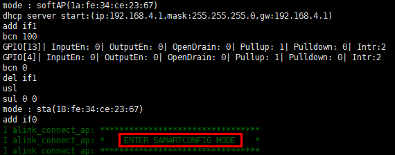

本工程为阿里云 ALINK V1.0 接口使用示例，你可以通过本示例了解 ALINK 配网、升级及数据传输等。

## 1 ALINK 概述
### 1.1 是什么 ALINK
智能硬件模组、阿里智能云、阿里智能 APP，阿里智能生活事业部为厂商提供一站式设备智能化解决方案。


### 1.2 为什么要使用 ALINK
阿里智能开发平台的提供强大的智能平台，极大的简化的智能家居开发的高难度和复杂性，主要有以下六个特点：低成本、短时间、大安全、大数据、标准化和定制化等。

### 1.3 怎么对接 ALINK
   我们已经完成 ALINK EMBED SDK 在模组上的适配工作，您在 产品开发时，只需基于模组基础上进行二次开发。


## 2 前置条件
### 2.1 知识储备
- 了解 ALINK
请详细阅读阿里提供的官方[技术文档](https://open.aliplus.com/docs/open/)，了解 ALINK 相关的概念
- 熟悉 ESP8266 开发
请详细阅读 [ESP8266入门指南](http://espressif.com/zh-hans/support/explore/get-started/esp8266/getting-started-guide)

### 2.2 硬件准备
- 开发板：一块以上 ESP_WROOM_02 开发板
- 路由器：关闭 5G 网络，且可以连接外网（所有的数据交互必需通过阿里云服务器）
- 手机：内置有 SIM 卡，可连接 4G 移动网络（测试热点配网功能时，设备需要通过手机热点连接阿里云服务器完成的注册、绑定等过程）

## 3 开发板介绍



    标号 1 开关拨下（拨下为断电状态，拨上为上电状态）；
    标号 2 开关拨下（拨下为下载模式，拨上为运行模式）；
    标号 3 开关拨上（CHIP_EN PIN，默认拨上即可）；
    标号 4 跳线帽插入上方的两个针脚；
    标号 5 插入跳线帽；
    标号 6 长按（>=3s）设备进入配网模式；
    标号 9 出厂设置开关，长按（>=3s）设备端会解绑并恢复出厂设置；
    标号 10 焊接 GPIO4 与 SW2 旁边的小圆孔，使能 SW2 按键，即出厂设置开关。

## 4 文件结构

    esp8266-alink-v1.0
    ├── bin                                      // 存放生成的 bin 文件
    ├── docs                                     // demo 使用文档的图片
    ├── driver                                   // 按键驱动
    ├── esp8266-rtos-sdk                         // ESP8266 SDK
    ├── gen_misc.sh                              // 编译脚本
    ├── include                                  // 用户配置头文件
    ├── Makefile                                 // 通过 Makefile 来配置 ALINK 选项
    ├── platforms                                // 平台相关文件
    │   ├── alink                                // alink 相关 API
    │   │   ├── adaptation                       // ALINK 的底层适配
    │   │   ├── application                      // ALINK 应用层 API 的封装
    │   │   │   ├── esp_alink_data_transport.c   // ALINK 数据传传输
    │   │   │   ├── esp_alink_main.c             // 连接 AP 、恢复出厂设置、事件回调函数
    │   │   │   ├── esp_info_store.c             // FLASH 的读写操作
    │   │   │   └── Makefile
    │   │   ├── include
    │   │   │   ├── alink_adaptation.h           // 应用层适配时定义的一些 API
    │   │   │   ├── alink_export.h               // ALINK 官方提供的原生应用层 API
    │   │   │   ├── alink_export_rawdata.h       // ALINK 官方提供的原生应用层 API
    │   │   │   ├── alink_json.h                 // ALINK 官方提供的原生 JSON API
    │   │   │   ├── esp_alink.h                  // 封装的应用层 API 使用说明及配置
    │   │   │   ├── esp_alink_log.h              // 定义了打印等级
    │   │   │   └── esp_info_store.h             // 信息存储 API 详解及 EXAMPLE
    │   │   ├── Makefile
    │   │   └── README.md                        
    │   └── Makefile
    ├── README.md                                // demo 使用文档
    └── user                                     // 用户相关文件
        ├── alink_key_trigger.c                  // 按键触发函数
        ├── ALINKTEST_LIVING_LIGHT_SMARTLED_LUA.lua  // 透传示例使用的 LUA 脚本
        ├── Makefile
        ├── sample_json.c                        // ALINK 非透传示例
        ├── sample_passthrough.c                 // ALINK 透传示例
        └── user_main.c                          // 用户程序入口

## 5 编译环境的搭建
您可以使用 xcc 和 gcc 来编译项目，建议使用 gcc。对于 gcc，请参考[esp-open-sdk](https://github.com/pfalcon/esp-open-sdk)。

## 6 配置与编译
1. **配置**，您可以通过修改 Makefile 下的配置，配置日志等级、数据包的大小等  

```bash
        /*!< 打开 json 调试，您可以查看任务的栈空间使用情况判断是事出现栈溢出 */
        CCFLAGS += -D SAMPLE_JSON_DEBUG
        
        /*!< 打开后编译透传示例，默认编译非透传示例 */
        CCFLAGS += -D CONFIG_ALINK_PASSTHROUGH
        
        /*!< 用户程序 log 等级 */
        CCFLAGS += -D CONFIG_LOG_ALINK_LEVEL=5
        
        /*!< ALINK SDK 的 log 等级 */
        CCFLAGS += -D CONFIG_ALINK_SDK_LOG_LEVEL=5
```

2. **编译**，如果您是在 ubuntu 的平台下开发只需运行脚本 `gen_misc.sh`，其他平台的参见：https://github.com/pfalcon/esp-open-sdk  

## 7 固件烧写（windows）
1. 安装[串口驱动](http://www.usb-drivers.org/ft232r-usb-uart-driver.html)  
2. 安装[烧写工具](http://espressif.com/en/support/download/other-tools)
3. 烧录相关 bin 文件，ESP8266 开发板中标号 1 拨上，给开发板上电；标号 2 开关拨下，进入下载状态。

    

        boot.bin------------------->0x000000    // 启动程序
        user1.2048.new.5.bin------->0x01000     // 主程序
        blank_12k.bin-------------->0x1F8000    // 初始化用户参数区
        blank.bin------------------>0x1FB000    // 初始化 RF_CAL 参数区。
        esp_init_data_default.bin-->0x1FC000    // 初始化其他射频参数区
        blalk.bin------------------>0x1FE000    // 初始化系统参数区

    > 注：ESP-LAUNCHER 上的 J82 跳针需要用跳线帽短接，否则无法下载

4. 将 ESP8266 开发板标号 2 开关拨上，设置开发板为运行模式；将标号 1 开关拨上，给开发板上电，出现“ENTER SAMARTCONFIG MODE”信息，即表示 ALINK 程序正常运行，进入配网模式。

    

## 8 运行与调试
1. 下载阿里[智能厂测包](https://open.aliplus.com/download)，
2. 登陆淘宝账号
3. 开启配网模组测试列表：
    - 安卓：点击“环境切换”，勾选“开启配网模组测试列表”
    - 苹果：点击“AKDebug”->测试选项，勾选“仅显示模组认证入口”
4. 添加设备：添加设备->“分类查找”中查找对应的类别->模组认证->智能云-smartled
    > 若使用透传示例，则选择： 智能云-smartled_lua
   
5. 按键说明：
    - 重新配网：长按 IO13_RESET_KEY 按键（>=3s）
    - 出厂设置：长按 SW2 按键（>=3s）

## 9 开发流程
### 9.1 [签约入驻](https://open.aliplus.com/docs/open/open/enter/index.html)
使用淘宝账号签约入驻阿里平台，并完成账号授权
### 9.2 [产品注册](https://open.aliplus.com/docs/open/open/register/index.html)
产品注册是设备上云的必要过程，任何一款产品在上云之前必须完成在平台的注册
### 9.3 [产品开发](https://open.aliplus.com/docs/open/open/develop/index.html)
> 注：1. 除非您有特殊需求，否则您在开发时只需修改 user 下的代码，无需关心其内部实现细节
> 　　2. 您需要先开发手机APP，alink embed 版本需要单独的开发的APP，除demo外使用阿里小智将无法进行设备的配网，控制等操作

1. **初始化**

    阿里服务器后台导出设备 TRD 表格,并将相应信息修改 `user_config.h` 下相应的宏定义即可，系统会调用`alink_init()`传入产品注册的信息，注册事件回调函数
    ```c
    #define DEV_NAME              "ALINKTEST"
    #define DEV_BRAND             "espressif"
    #define DEV_CATEGORY          "LIVING"
    #define DEV_TYPE              "LIGHT"
    #define DEV_MANUFACTURE       "ALINKTEST"
    #define DEV_MODEL             "ALINKTEST_LIVING_LIGHT_SMARTLED"
    /* key/secret */
    #define ALINK_KEY             "ljB6vqoLzmP8fGkE6pon"
    #define ALINK_SECRET          "YJJZjytOCXDhtQqip4EjWbhR95zTgI92RVjzjyZF"
    /* sandbox key/secret */
    #define ALINK_KEY_SANDBOX     "dpZZEpm9eBfqzK7yVeLq"
    #define ALINK_SECRET_SANDBOX  "THnfRRsU5vu6g6m9X6uFyAjUWflgZ0iyGjdEneKm"
    /* device hardware information */
    #define DEV_SN                "1234567890"
    #define DEV_VERSION           "1.0.0"
    /* device MAC addr and chip ID, should acquired by call functions */
    #define DEV_MAC               ""
    #define DEV_CHIPID            ""  
    ```

2. **配网**
    - 事件回调函数：
        - 设备配网过程中的所有动作，都会传入事件回调函数中，您可以根据实际需求事件回调函数相应的做相应处理，如在当设备进入配置配网模式灯慢闪，等待激活时灯快闪等
        ```c
        typedef enum {
            ALINK_EVENT_CLOUD_CONNECTED = 0,/*!< ESP8266 connected from alink cloude */
            ALINK_EVENT_CLOUD_DISCONNECTED, /*!< ESP8266 disconnected from alink cloude */
            ALINK_EVENT_GET_DEVICE_DATA,    /*!< Alink cloud requests data from the device */
            ALINK_EVENT_SET_DEVICE_DATA,    /*!< Alink cloud to send data to the device */
            ALINK_EVENT_POST_CLOUD_DATA,    /*!< The device sends data to alink cloud  */
            ALINK_EVENT_WIFI_CONNECTED,     /*!< ESP8266 station got IP from connected AP */
            ALINK_EVENT_WIFI_DISCONNECTED,  /*!< ESP8266 station disconnected from AP */
            ALINK_EVENT_CONFIG_NETWORK,     /*!< The equipment enters the distribution mode */
            ALINK_EVENT_UPDATE_ROUTER,      /*!< Request to configure the router */
            ALINK_EVENT_FACTORY_RESET,      /*!< Request to restore factory settings */
        } alink_event_t;
        ```
        - 如果您需要传入自己定义的事件，可以通过调用 `alink_event_send()` 发送自定义事件
        - 事件回调函数的栈默认大小为 1KB, 请避免在事件回调函数使用较大的栈空间，如需修改请修改该任务栈空间
    - 主动上报：当设备成功连接到阿里云服务器时需要主动上报设备的状态，以保证云端数据与设备端同步，否则将无法配网成功

3. **修改触发方式**

    您需要根据实际产品，确定以何种方式触发出厂设置、重新配网等操作，本示例使用的是按键触发方式，如果设备没有按键，您可以通过反复开关电源、通过蓝牙等方式触发，具体修改参见 `alink_key_trigger.c`
    ```c
    static void key_13_short_press(void)
    {
        ALINK_LOGD("short press..");
    }

    static void key_13_long_press(void)
    {
        ALINK_LOGD("long press..");
        alink_event_send(ALINK_EVENT_UPDATE_ROUTER);
    }

    static void key_sw2_short_press(void)
    {
        ALINK_LOGD("short press..");
    }

    static void key_sw2_long_press(void)
    {
        ALINK_LOGD("long press..");
        alink_event_send(ALINK_EVENT_FACTORY_RESET);
    }
    ```

4. **数据通信**
    - 数据格式：确认设备通信时的数据格式（透传/非透传）
        - 透传：设备端收到的二进制格式的数据。由阿里云端服务器的 lua 脚本完成 json 格式与二进制数据的转换
        - 非透传：设备端收到的 JSON 格式的数据，JSON 格式的转换由设备端完成，阿里云端服务器的 lua 脚本是空实现
    - 数据长度：由于esp8266内存有限，因此数据长度调整为上报1KB，下发2KB
    - 数据上报：主动上报是由设备端主动发起
    - 数据下发：设备端收的到的数据有设置设备状态和获取设备状态组成

5. **日志等级**

    本工程的日志分为：alink 官方日志和 esp8266 适配层日志。日志共分为了七个级别，每一级别的日志在输出时均有颜色和相应的标识以区分，日志前带有"<>"的为alink 官方日志，设置日志后比当前级别低的日志均输出。
    - 配置

        ```bash
        # 日志等级列表
        # default 0 if LOG_ALINK_LEVEL_NONE
        # default 1 if LOG_ALINK_LEVEL_FATAL
        # default 2 if LOG_ALINK_LEVEL_ERROR
        # default 3 if LOG_ALINK_LEVEL_WARN
        # default 4 if LOG_ALINK_LEVEL_INFO
        # default 5 if LOG_ALINK_LEVEL_DEBUG
        # default 6 if LOG_ALINK_LEVEL_VERBOSE
        # esp8266 适配层日志等级配置
        CCFLAGS += -D CONFIG_LOG_ALINK_LEVEL=5
        # alink 官方日志等级配置
        CCFLAGS += -D CONFIG_ALINK_SDK_LOG_LEVEL=5
        ```
    - 示例
    alink 日志的使用方法与printf一致
        ```c
        /* 定义日志文件标识 */
        static const char *TAG = "sample_json";

        ALINK_LOGI("compile time : %s %s", __DATE__, __TIME__);
        ```
> 注：1. 模组认证时，需将 alink 官方日志等级设置为 bebug 模式;
> 　　2. 在进行高频测试时，需将日志等级都设置成 info 模式，以免过多的日志信息影响高频测试。

6. **信息存储**

    为了方便您的使用，我们将flash的读写操作进行了封装，您可以通过 key_value 的方式进行数据存储，无需关心 flash 的擦写，4字节对齐等问题。
    - 配置（在 Makefile 中添加如下定义进行配置）

        ```bash
        # 存储flash的位置
        CCFLAGS += -D CONFIG_INFO_STORE_MANAGER_ADDR=0x1f8000
        # 标识信息字符串 key 的最大长度
        CCFLAGS += -D CONFIG_INFO_STORE_KEY_LEN=16
        # 存储信息的个数，每多一条信息记录需要多占用 60B
        CCFLAGS += -D CONFIG_INFO_STORE_KEY_NUM=5
        ```
    - 示例

        ```c
        /*!< 初始化存储信息管理列表 */
        char buf[16] = "12345678910";
        esp_info_init();

        /*!< 数据保存 */
        esp_info_save("test_buf", buf, sizeof(buf));

        /*!< 数据加载 */
        memset(buf, 0, sizeof(buf));
        esp_info_load("test_buf", buf, sizeof(buf));
        printf("buf: %s\n", buf);

        /*!< 数据擦除 */
        esp_info_erase("test_buf");
        ```
    > 注：总存储信息量不能超过4KB。为了保证在写 flash 时出现突然断电，对数据的破坏，我们采用了12k的空间来存储4KB的数据，
    第一个4KB来记录存储的位置，另两个4KB的空间用于对数据进行存储备份。

## 10 注意事项
- 请定期更新本项目工程，后期将有持续对本工程进行优化改进
- 模组不支持 5G 网络，请确认已关闭路由器 5G 网络功能
- 测试热点配网时，请确认 4G 网络处于开启状态
- ALINK 受网络环境影响极大，进行测试时，请保证网络环境良好，否则将无法通过高频压测和稳定性测试。

## 11 Related links
- ESP8266 入门指南 : http://espressif.com/zh-hans/support/explore/get-started/esp8266/getting-started-guide
- 阿里智能开放平台：https://open.aliplus.com/docs/open/
- 烧录工具  : http://espressif.com/en/support/download/other-tools
- 串口驱动  : http://www.usb-drivers.org/ft232r-usb-uart-driver.html

