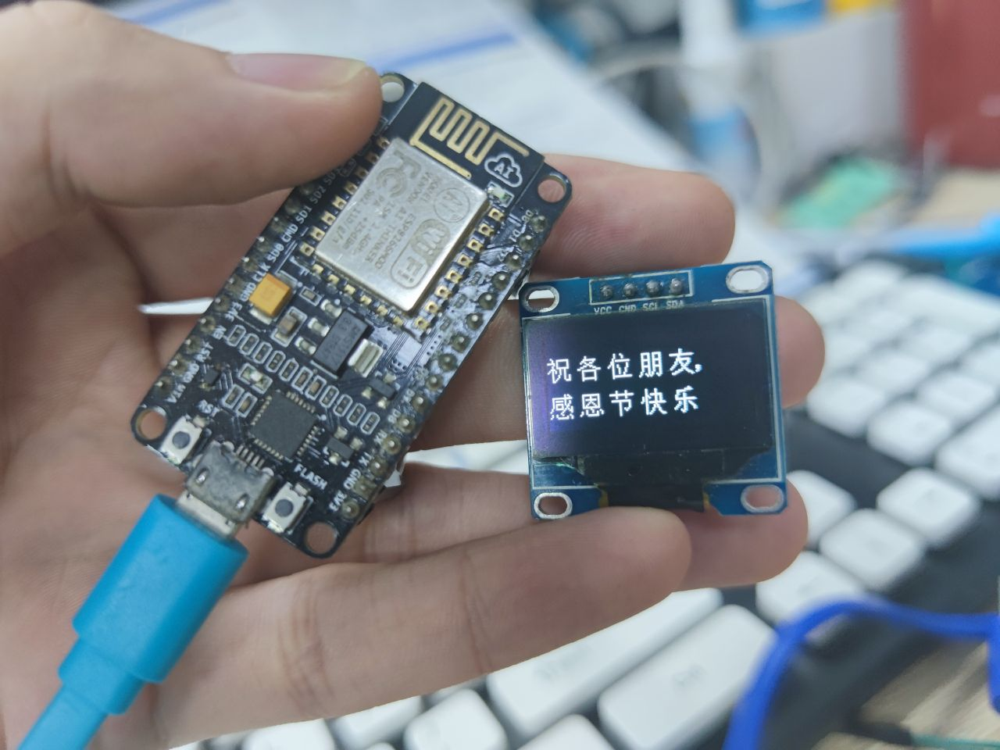

# SPI OLED 例子  

_This example uses the ESP8266 hspi Master to drive 0.96-inch SPI OLED, and the OLED driver chip is SSD1306._

这个例程基于 ESP8266_RTOS_SDK master 分支 SPI 驱动 0.96英寸的OLED屏幕 SSD1306。

## 如何使用  

### 硬件接线 

* 接线图:  

| Signal    | Oled   | ESP8266|
|-----------|--------|--------|
| 3.3V      | VCC    | VCC    |
| SCLK      | D0(SCL)| GPIO14 |
| D/C       | DC     | GPIO12 |
| MOSI      | D1(SDA)| GPIO13 |
| RST       | RES    | GPIO15 |
| CS        | CS     | GND    |
| GND       | GND    | GND    |

* 截图:  

    
